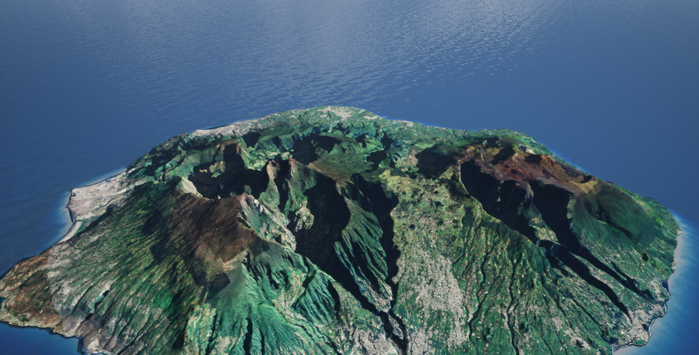
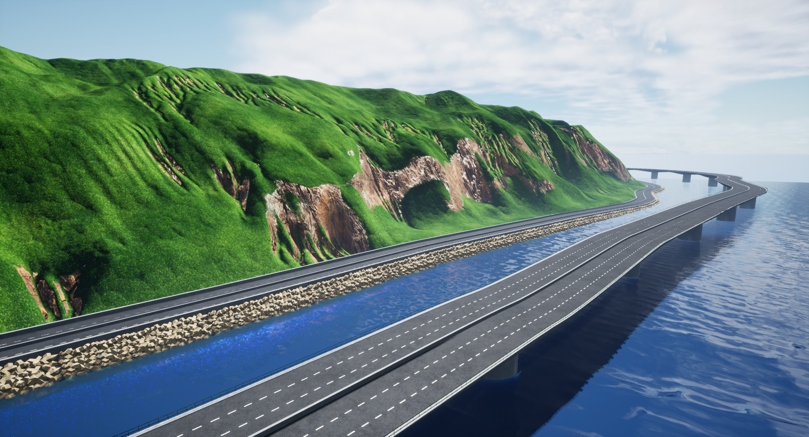
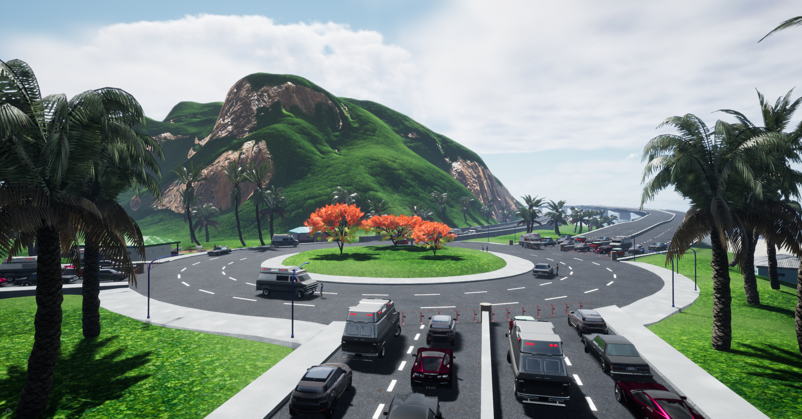

# GrandRaid

Un prototype de jeu vidéo sur une épreuve sportive fictive basée sur le Grand Raid de l'île de La Réunion ! Réalisé au cours du Master 1 d' Informatique à l'Université de La Réunion dans le cadre d' un travail encadré de recherche.

## Moteur de jeu

Unreal engine 4

## Crédits

Contains assets from ambientCG.com, licensed under CC0 1.0 Universal.

### Audio

- Musiques d' Olivier Sébastien
- Ocean-waves by Noted451 is licensed under Creative Commons (https://freesound.org/people/Noted451/sounds/531015/)
- Crowd Cheer II by FoolBoyMedia is licensed under Creative Commons (https://freesound.org/people/FoolBoyMedia/sounds/397435/)

### Végétation

- "Palm Trees" by ElectroNick is licensed under Creative Commons Attribution (https://sketchfab.com/3d-models/palm-trees-20f8a8d5054b4191afb7cf3270dbd586)
- "Some Foliage" (https://skfb.ly/6GEQW) by soidev is licensed under Creative Commons Attribution (http://creativecommons.org/licenses/by/4.0/).
- "Banana tree" (https://skfb.ly/6RUIq) by Alnazir is licensed under Creative Commons Attribution (http://creativecommons.org/licenses/by/4.0/).
- "Bamboo Bush" (https://skfb.ly/6WFQJ) by sujirour is licensed under Creative Commons Attribution (http://creativecommons.org/licenses/by/4.0/).
- "Cypress tree" (https://skfb.ly/6U9rz) by ElectroNick is licensed under Creative Commons Attribution (http://creativecommons.org/licenses/by/4.0/).
- "Realistic Tree Model" (https://skfb.ly/6xHD9) by aliyeredonarbab is licensed under Creative Commons Attribution (http://creativecommons.org/licenses/by/4.0/).

### Véhicules

- "80 American Sedan - Low poly model" (https://skfb.ly/oorvZ) by Daniel Zhabotinsky is licensed under Creative Commons Attribution (http://creativecommons.org/licenses/by/4.0/).
- "Chevrolet Corvette (C7)" (https://skfb.ly/6XWAF) by Bexxie is licensed under Creative Commons Attribution (http://creativecommons.org/licenses/by/4.0/).
- "Range Rover Evoque" (https://skfb.ly/MGDD) by minghauLoh is licensed under Creative Commons Attribution (http://creativecommons.org/licenses/by/4.0/).
- "British compact car - Low poly model" (https://skfb.ly/6Vs8M) by Daniel Zhabotinsky is licensed under Creative Commons Attribution (http://creativecommons.org/licenses/by/4.0/).
- "Old Ambulance van - Low Poly model" (https://skfb.ly/6VsH9) by Daniel Zhabotinsky is licensed under Creative Commons Attribution (http://creativecommons.org/licenses/by/4.0/).
